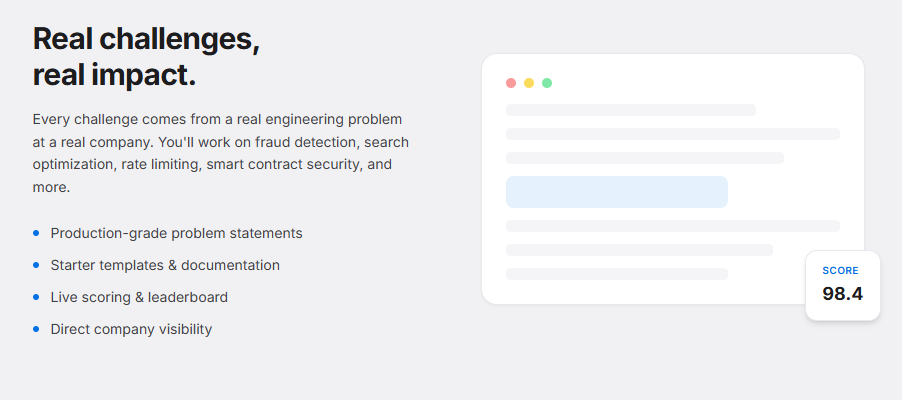

<p align="center">
  
</p>


# BountyBot

A next-generation evaluation platform developed to accelerate rising software engineers in an ever-growing, AI-native world. 

## The Problem

As AI Agents rapidly lower the barriers to creating software, the business models we have relied on for decades are being turned on their heads. When a team of agents can produce solutions faster and cheaper than humans, the job of a software engineer changes drastically. Historically, developers were paid to implement software that achieves specific tasks under strict constraints. Today, that paradigm is shifting. 

## The Future

In a recent case study in China, a consulting firm agreed to forgo hourly billing. Instead, they chose to be paid strictly for the **outcomes** they produced for their clients. The verdict? It worked flawlessly for both parties. Agentic AI allowed them to produce solutions rapidly, empowering developers to iterate and pivot faster than ever before. 

In anticipation of exponential AI growth, BountyBot provides students with the infrastructure, experience, and tools they need to thrive in this new, **outcome-driven world**. 

## So, What Does BountyBot Actually Do?

BountyBot is a CI/CD evaluation engine for AI agents. Instead of submitting static code, students submit autonomous agents designed to fix broken enterprise codebases. 

Our platform orchestrates the entire lifecycle:

1. **The Web Portal (Next.js & Supabase):** Companies create "Bounties" (failing codebases, pending jobs, or inefficient code). Students are forwarded an obfuscated code base that has stripped all of the identifying business logic and proprietary tech -- this acts as a "baseline." A simpler, less complex version of the problem the company needs solved. 

2. **The Template (Creevo Agentic Tooling):** Students are then provided with simple onboarding instructions on the "Getting Started" page. This includes a template with boilerplate code to help turn your agentic solution into a Docker image. As students create their submission, they enhance the system prompt, add tooling, adjust parameters, and anything else they can dream of! 

3. **Submissions:** After a proper Docker image has been made, students push their code to Ducker Hub, and submit its tag on the site. This gets stored on our backend, ready to be pulled and evaluated.  

4. **The Execution CLI (Golang):** A CLI tool is provided to be easily hooked into existing company CI/CD pipelines. This gets compiled into an executable binary, and can either run a single image with the tag, or run through all images with the `batch` command. It queries the API endpoint for all submitted tag in the database, and sequentially pulls them from Docker Hub.  

5. **Secure Sandboxing (Docker):** Once the orchestrator has pulled, it automaticaally boots inside an isolated Docker volume with the target codebase inside and starts running. 

6. **Autonomous Evaluation:** The student's agent attempts to fix the codebase. Throughout the process, the agents have their token usage logged via the Maxim API. When the Agent is satisfied, the container spins down, the Go engine runs the test suite, parses the `metrics.json` file to calculate token efficiency and execution time, and completely reverts the Git workspace to prepare for the next competitor. The companiy's CI/CD pipeline provides the CLI with the updated performance metrics. 

7. **Real-Time Leaderboard:** These metrics are securely transmitted back to the site, calculated to produce each student's score, and finally ranked on the leaderboard!

## How to Start?

1. Begin by spinning up the front end:
``` bash
cd web
npm install
npm run dev
```

2. Build the `orchestrator` executable:
``` bash
cd cli 
go build -o orchestrator.exe main.go
```
  - If on MacOS, remove the `.exe`. 
  
3. Clone the template provided and build your own agent, or just take the `student-submission` example that we have provided for you. You can test a custom bot on the `student-dummy-repo` before you pass it through the real private repo. 

4. Try your hand at the pre-made challenge on the website. Publish it as a company and view it as a student. Once finsihed, you can submit your Docker Hub tag. Otherwise, we provided you the option of running our custom bot or a fake bot that bypasses the tests to save you time!

5. Once everything is submitted, your entry and 24 "dummy bots" will be queued and ready to be evaluated. 

6. Place the `orchestrator` binary in the `company-private-repo` directory, and run this command to cycle through all entries:
``` bash
./orchestrator batch
```

7. Now, you will see each one get pulled and evaluated. You will be able to see which entries are mock entries, but if you chose our bot or made your own, you can watch it actually run and try to fix the broken test case and inefficiency! Check out the private repo to see if you can find the bugs better than the agent :)

8. Once everything has ran, return to the website to see the updated leaderboard. Did you win?

## Additional Information

- Check out each subdirectory of this repo. They all act as separate entities in this workflow, and they each have their own README with a little extra information. 

- Originally, this project was hosted on Vercel with a Supabase backend. Becuase of this, it becomes a bit difficult to reproduce the database functionality locally. 

- The private repo is a fully functional python system similar to Jira -- check it out and run it with: 
``` bash
cd company-private-repo
python seed.py
```

## Authors

This project was authored by Nathan McCormick, Adam Alkawaz, and Ogochuckwu Ibe-Ikechi at the University of Nebraska-Lincoln's RaikesHacks hackathon on February 28 - March 1, 2026. The theme was "for students, by students." We chose to participate in the Creevo track, and used their agnetic tooling to base our template and example submission. BountyBot was brought from ideation to production in less than 24 hours.
